## Topic1-Hyperspectral image classification

### Few-shot classification

<table width="100%" class="imgtable"><tbody><tr><td width="306">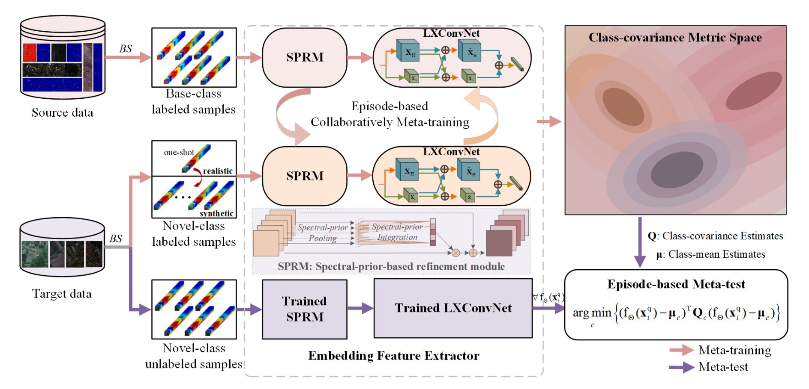</td><td><a href="https://ieeexplore.ieee.org/document/9841445">Few-shot Learning With Class-Covariance Metric for Hyperspectral Image Classificationc</a> <b>Bobo Xi</b>, Bobo Xi, Yun Zhang, Jiaojiao Li, Yunsong Li, Zan Li, Jocelyn Chanussot,  <i>IEEE Transactions on Image Processing, (<b>TIP</b>)</i>, 2022. (<b>SCI Q1 Top, IF=10.6</b>) [<a href="https://ieeexplore.ieee.org/document/9841445">Paper</a>][<a href="https://github.com/B-Xi/TIP_2022_CMFSL">Code</a>]</td></tr></tbody></table>

<table width="100%" class="imgtable"><tbody><tr><td width="306"></td><td><a href="https://ieeexplore.ieee.org/document/10684809/">CTF-SSCL: CNN-Transformer for Few-shot Hyperspectral Image Classification Assisted by Semisupervised Contrastive Learning</a> <b>Bobo Xi</b>, Yun Zhang, Jiaojiao Li, Yunsong Li, Zan Li, Jocelyn Chanussot,  <i>IIEEE Transactions on Geoscience and Remote Sensing, (<b>TGRS</b>)</i>, 2024. (<b>SCI Q1 Top, IF=8.2</b>) [<a href="https://ieeexplore.ieee.org/document/10684809/">Paper</a>][<a href="https://github.com/B-Xi/CTF-SSCL">Code</a>]</td></tr></tbody></table>

### Imbalanced classification

<table width="100%" class="imgtable"><tbody><tr><td width="306">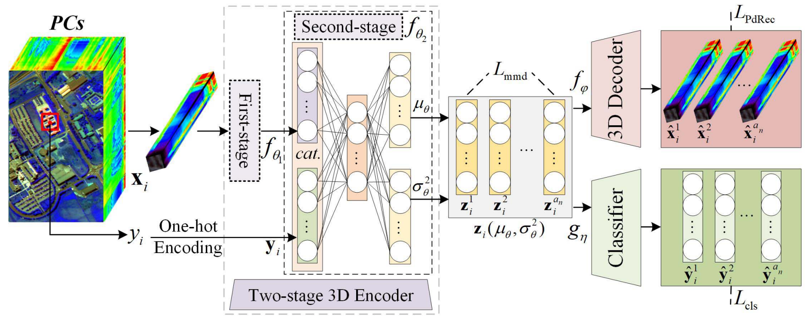</td><td><a href="https://ieeexplore.ieee.org/document/9924229">DGSSC: A Deep Generative Spectral-Spatial Classifier for Imbalanced Hyperspectral Imagery</a> <b>Bobo Xi</b>, Jiaojiao Li, Yan Diao, Yunsong Li, Zan Li, Yan Huang, Jocelyn Chanussot, <i>IEEE Transactions on Circuits and Systems for Video Technology, (<b>TCSVT</b>)</i>, 2023. (<b>SCI Q1 Top, IF=8.4</b>) [<a href="https://ieeexplore.ieee.org/document/9924229">Paper</a>][<a href="https://github.com/B-Xi/TCSVT_2022_DGSSC">Code</a>]</td></tr></tbody></table>

<table width="100%" class="imgtable"><tbody><tr><td width="306">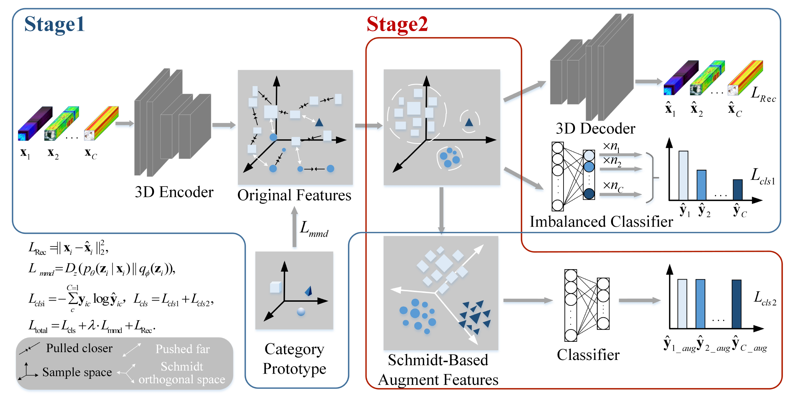</td><td><a href="https://ieeexplore.ieee.org/document/10258305">Class-Specific Auto-augment Architecture Based on Schmidt Mathematical Theory for Imbalanced Hyperspectral Classification</a> Jiaojiao Li, Yan Diao, Rui Song, <b>Bobo Xi*</b>, Yunsong Li, Qian Du, <i>IEEE Transactions on Geoscience and Remote Sensing, (<b>TGRS</b>)</i>, 2023. (<b>SCI Q1 Top, IF=8.2</b>) [<a href="https://ieeexplore.ieee.org/document/10258305">Paper</a>][<a href="https://github.com/jojolee6513/CACS">Code</a>]</td></tr></tbody></table>

### Semi-supervised classification

<table width="100%" class="imgtable"><tbody><tr><td width="306">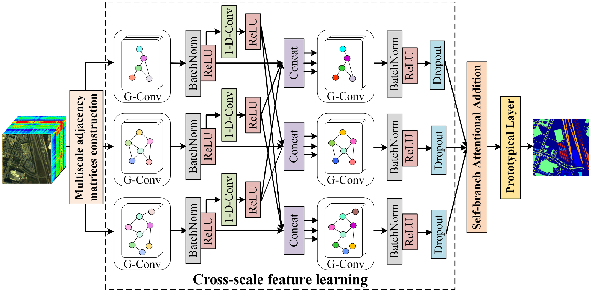</td><td><a href="https://ieeexplore.ieee.org/document/9740412">Semisupervised Cross-scale Graph Prototypical Network for Hyperspectral Image Classification</a> <b>Bobo Xi</b>, Jiaojiao Li, Yunsong Li, Rui Song, Yuchao Xiao, Qian Du, Jocelyn Chanussot, <i>IEEE Transactions on Neural Networks and Learning Systems, (<b>TNNLS</b>)</i>, 2023. (<b>SCI Q1 Top, IF=14.255</b>) [<a href="https://ieeexplore.ieee.org/document/9740412">Paper</a>][<a href="https://github.com/B-Xi/TNNLS_2022_X-GPN">Code</a>]</td></tr></tbody></table>

<table width="100%" class="imgtable"><tbody><tr><td width="306">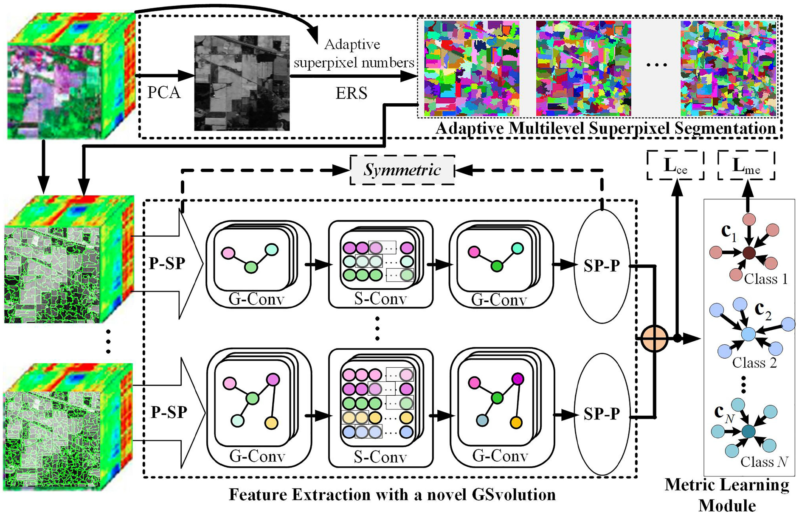</td><td><a href="https://ieeexplore.ieee.org/document/9652087">SGML: A Symmetric Graph Metric Learning Framework for Efficient Hyperspectral Image Classification</a>  Yunsong Li, <b>Bobo Xi*</b>, Jiaojiao Li, Rui Song, Yuchao Xiao, Jocelyn Chanussot, <i>IEEE Journal of Selected Topics in Applied Earth Observations and Remote Sensing, (<b>JSTARS</b>)</i>, 2022. (<b>SCI Q2 Top, IF=4.7</b>) [<a href="https://ieeexplore.ieee.org/document/9652087">Paper</a>][<a href="https://github.com/B-Xi/JSTARS_2021_SGML">Code</a>]</td></tr></tbody></table>

### Feature extraction

<table width="100%" class="imgtable"><tbody><tr><td width="306">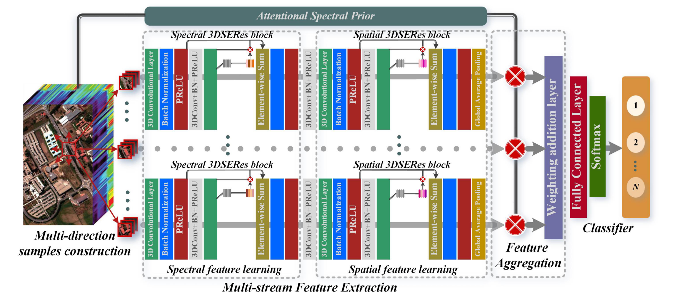</td><td><a href="https://ieeexplore.ieee.org/document/9325080">Multi-direction Networks With Attentional Spectral Prior for Hyperspectral Image Classification</a> <b>Bobo Xi</b>, Jiaojiao Li, Yunsong Li, Rui Song, Yuchao Xiao, Yanzi Shi, Qian Du, <i>IEEE Transactions on Geoscience and Remote Sensing, (<b>TGRS</b>)</i>, 2022. (<b>SCI Q1 Top, IF=8.2</b>) [<a href="https://ieeexplore.ieee.org/document/9325080">Paper</a>][<a href="https://github.com/B-Xi/TGRS_2021_MDN-ASP">Code</a>]</td></tr></tbody></table>

<table width="100%" class="imgtable"><tbody><tr><td width="306">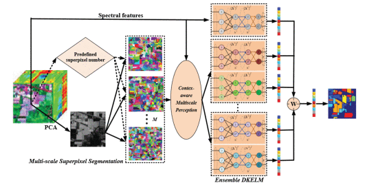</td><td><a href="https://ieeexplore.ieee.org/document/9203816">Multiscale Context-aware Ensemble Deep KELM for Efficient Hyperspectral Image Classification</a> <b>Bobo Xi</b>, Jiaojiao Li, Yunsong Li, Rui Song, Weiwei Sun, Qian Du, <i>IEEE Transactions on Geoscience and Remote Sensing, (<b>TGRS</b>)</i>, 2021. (<b>SCI Q1 Top, IF=8.2</b>) [<a href="https://ieeexplore.ieee.org/document/9203816">Paper</a>][<a href="https://github.com/B-Xi/TGRS_2020_MSC-EDKELM">Code</a>]</td></tr></tbody></table>

## Topic2-Multimodal classification

### Fusion classification

<table width="100%" class="imgtable"><tbody><tr><td width="306">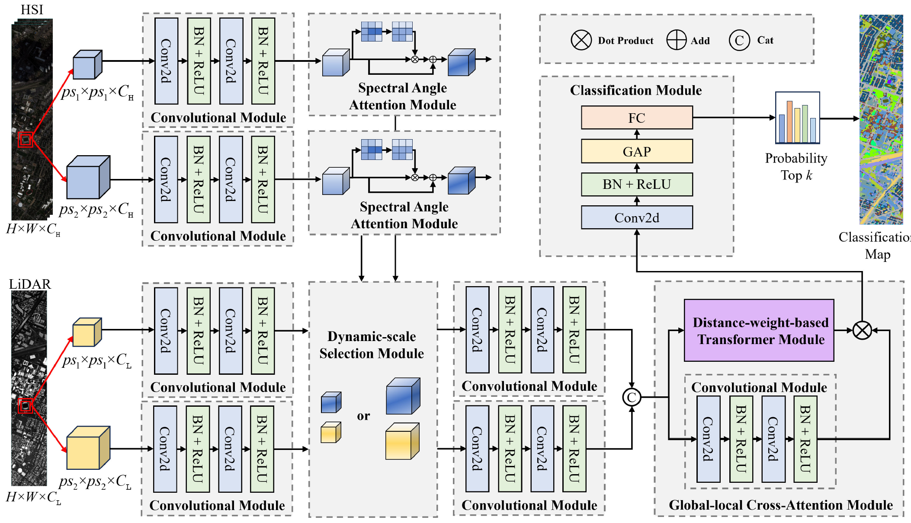</td><td><a href="https://ieeexplore.ieee.org/document/10669994">Multilevel Attention Dynamic-Scale Network for HSI and LiDAR Data Fusion Classification</a> Yufei He, <b>Bobo Xi*</b>, Guocheng Li, Tie Zheng, Yunsong Li, Changbin Xue, Jocelyn Chanussot,  <i>IEEE Transactions on Geoscience and Remote Sensing, (<b>TGRS</b>)</i>, 2024. (<b>SCI Q1 Top, IF=8.2</b>) [<a href="https://ieeexplore.ieee.org/document/10669994">Paper</a>]</td></tr></tbody></table>

<table width="100%" class="imgtable"><tbody><tr><td width="306">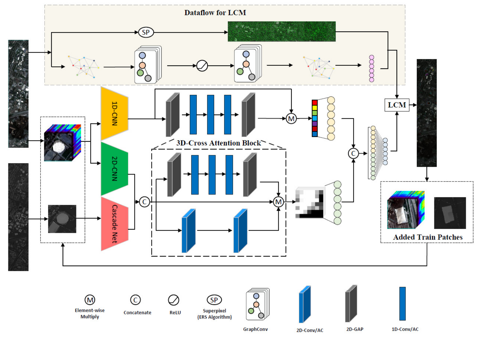</td><td><a href="https://ieeexplore.ieee.org/document/9915611">A Triplet Semi-supervised Deep Network for Fusion Classification of Hyperspectral and LiDAR Data</a> Jiaojiao Li, Yinle Ma, Rui Song, <b>Bobo Xi*</b>, Yunsong Li, Danfeng Hong, Qian Du, <i>IEEE Transactions on Geoscience and Remote Sensing, (<b>TGRS</b>)</i>, 2021. (<b>SCI Q1 Top, IF=8.2</b>) [<a href="https://ieeexplore.ieee.org/document/9915611">Paper</a>][<a href="https://github.com/jojolee6513/TSDN">Code</a>]</td></tr></tbody></table>

### Zero-shot scene classification

<table width="100%" class="imgtable"><tbody><tr><td width="306">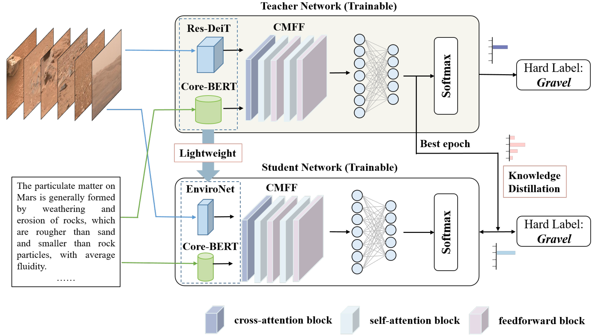</td><td><a href="https://ieeexplore.ieee.org/document/10699382">A Lightweight Framework With Knowledge Distillation for Zero-Shot Mars Scene Classification</a> Xiaomeng Tan, <b>Bobo Xi*</b>, Haitao Xu, Jiaojiao Li, Yunsong Li, Changbin Xue, Jocelyn Chanussot,  <i> IEEE Transactions on Geoscience and Remote Sensing, (<b>TGRS</b>)</i>, 2024. (<b>SCI Q1 Top, IF=8.2</b>) [<a href="https://ieeexplore.ieee.org/document/10699382">Paper</a>][<a href="https://github.com/XM-Tan/KDMSC">Code</a>]</td></tr></tbody></table>   

<table width="100%" class="imgtable"><tbody><tr><td width="306">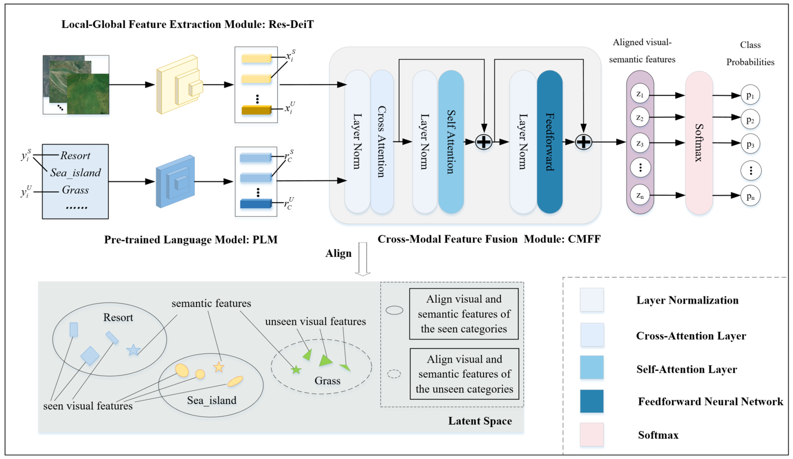</td><td><a href="https://ieeexplore.ieee.org/document/10557622">MFINet: A Novel Zero-Shot Remote Sensing Scene Classification Network Based on Multimodal Feature Interaction</a> Xiaomeng Tan, <b>Bobo Xi*</b>, Haitao Xu, Yunsong Li, Changbin Xue, Jocelyn Chanussot,  <i> IEEE Journal of Selected Topics in Applied Earth Observations and Remote Sensing, (<b>JSTARS</b>)</i>, 2024. (<b>SCI Q2 Top, IF=4.7</b>) [<a href="https://ieeexplore.ieee.org/document/10557622">Paper</a>][<a href="https://github.com/XM-Tan/MFINet">Code</a>]</td></tr></tbody></table>   